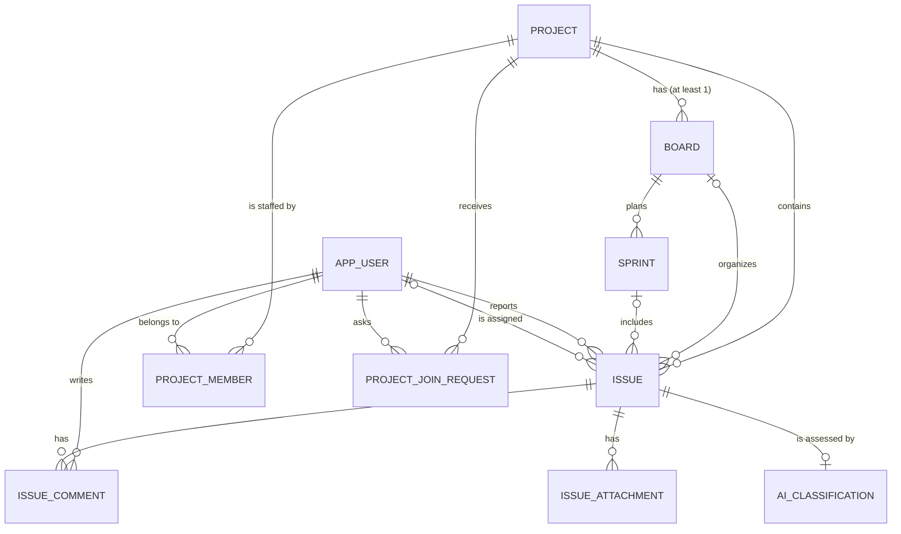

# DATA-MODEL.md — the tables and how they connect

Read from the live database, not from the migration files.

Since M4 there are **three databases**, all in the same Postgres process on 5433. The image is
`pgvector/pgvector:pg16` — Postgres 16 with the vector extension compiled in.

| Database | Owner | Holds |
|---|---|---|
| `workflow` | work-service | 10 business tables — projects, boards, sprints, issues, comments, attachments, people, AI classifications, and since M5 project membership and join requests |
| `authdb` | auth-service | 1 table — `account`, the credentials |
| `vectordb` | classification-service | 1 table — `issue_vector`, one embedding per issue |

Each has its own Liquibase changelog and its own connection. Nothing can join across them, and
that is the point rather than a limitation: see `account` and `issue_vector` at the end of this
file.

**`vectordb` is the only one that can be thrown away.** It holds derived data: every vector can be
rebuilt by replaying `issue.created` for each issue, which is what `POST /admin/issues/reindex`
does. The other two hold the record.

All ten business tables are here. `ai_classification` arrived at M3; `project_member` and
`project_join_request` arrived at M5.

---

## The picture



Read the symbols as: `||` exactly one, `|o` zero or one, `o{` zero or more.

---

## Every foreign key in one table

| Child table | Column | Points at | On delete | Meaning |
|---|---|---|---|---|
| `board` | `project_id` | `project` | **CASCADE** | a board cannot exist without its project |
| `sprint` | `board_id` | `board` | **CASCADE** | a sprint cannot exist without its board |
| `issue` | `project_id` | `project` | **CASCADE** | an issue cannot exist without its project |
| `issue` | `board_id` | `board` | **SET NULL** | the issue survives its board |
| `issue` | `sprint_id` | `sprint` | **SET NULL** | the issue survives its sprint |
| `issue` | `reporter_id` | `app_user` | **RESTRICT** | the reporter cannot be deleted |
| `issue` | `assignee_id` | `app_user` | **SET NULL** | the work stays, it becomes unassigned |
| `issue_comment` | `issue_id` | `issue` | **CASCADE** | comments die with the issue |
| `issue_comment` | `author_id` | `app_user` | **RESTRICT** | the author cannot be deleted |
| `issue_attachment` | `issue_id` | `issue` | **CASCADE** | attachments die with the issue |
| `project_member` | `project_id` | `project` | **CASCADE** | membership of a deleted project means nothing |
| `project_member` | `user_id` | `app_user` | **RESTRICT** | consistent with every other link to a person |
| `project_join_request` | `project_id` | `project` | **CASCADE** | the request dies with what it asked for |
| `project_join_request` | `user_id` | `app_user` | **RESTRICT** | |
| `project_join_request` | `decided_by_user_id` | `app_user` | **RESTRICT** | who approved it is part of the record |

Three delete rules, three different meanings:

- **CASCADE** — composition. The child has no life of its own. Deleting a project really does
  delete its boards, sprints, issues, comments and attachments.
- **SET NULL** — aggregation. The link disappears, the row stays. Deleting a board does not
  destroy work; the issues simply become "not on a board".
- **RESTRICT** — the delete is refused. This is why `app_user` has `is_active` and the API
  deactivates instead of deleting. Removing a reporter would erase who raised the ticket.

---

# project

The container. Everything else hangs off it.

| Column | Type | Null | Note |
|---|---|---|---|
| `id` | bigint | no | primary key, identity |
| `project_key` | varchar(10) | no | **unique**. `WORK`, `DEMO`. Named `project_key` because `KEY` is reserved in H2 |
| `name` | varchar(150) | no | |
| `description` | text | yes | |
| `issue_counter` | bigint | no | default 0. Last number handed out for an issue key |
| `join_code` | varchar(16) | no | **unique**. The secret you mail to somebody so they can ask to join. Added at M5 |
| `created_at` / `updated_at` | timestamp | no | filled by Hibernate |

**Relationships**

- one project → many **boards**. The class diagram says `1..*`, but SQL cannot say "at least one",
  so creating a project also creates a default KANBAN board, and deleting the last board of a
  project is refused with 422.
- one project → many **issues**.
- one project → many **members** and many **join requests** (M5).

**`join_code` is not `project_key`, and the difference is the whole point.** `project_key` is
printed on every ticket — `WORK-12` is on every card on the board. If it were also the way in,
anyone who had ever seen a ticket could ask to join. The key is a display name; the code is a
secret, twelve random characters, and the project manager can rotate it. Rotating invalidates
nothing that already exists: current members stay members and open requests stay open. It only
stops the *next* person from using an address book entry from a year ago.

**`issue_counter` is the interesting column.** It is incremented under `SELECT ... FOR UPDATE` on
the project row, then `project_key + "-" + counter` becomes the issue key. The row lock is what
stops two simultaneous creations from both producing `WORK-8`.

---

# app_user

A person. Named `app_user` because `user` is reserved in PostgreSQL — `SELECT * FROM user`
returns the session user, not your table.

| Column | Type | Null | Note |
|---|---|---|---|
| `id` | bigint | no | primary key |
| `username` | varchar(50) | no | **unique** |
| `email` | varchar(255) | no | **unique** |
| `role` | varchar(20) | no | `DEVELOPER`, `MANAGER`, `ADMIN`. Stored as text, never as a number |
| `is_active` | boolean | no | default true. Deactivation replaces deletion |
| `created_at` / `updated_at` | timestamp | no | |

**Relationships**

- one user → many **issues** as `reporter` (required)
- one user → many **issues** as `assignee` (optional)
- one user → many **comments** as `author`
- one user → many **project memberships** and **join requests** (M5)

**Two foreign keys from `issue` point back here** — `reporter_id` and `assignee_id`. That is why
neither side maps a `@OneToMany` collection: with two paths to the same table, an unnamed inverse
mapping makes Hibernate invent a third join table.

**No `password_hash` column here, and there never will be.** The hash lives on `account` in
`authdb`, owned by auth-service — see that table at the end of this file. The profile and the
credential have different owners.

**`is_active` here is a mirror, not the truth.** Since M5 the authority on whether somebody may
log in is `account.status` in `authdb`, which has three values rather than two. This column is
kept in step by auth-service so that work-service can filter an assignee dropdown without a
network call. A `PENDING` account has `is_active = false` here, which is what stops an unapproved
person from being assigned work.

---

# project_member
### added at M5

Who is on a project, and what they are on it.

| Column | Type | Null | Note |
|---|---|---|---|
| `id` | bigint | no | primary key |
| `project_id` | bigint | **no** | → `project`, CASCADE |
| `user_id` | bigint | **no** | → `app_user`, RESTRICT |
| `role` | varchar(20) | no | `PROJECT_MANAGER` or `MEMBER` |
| `joined_at` | timestamp | no | |

Constraints and indexes:

```sql
ALTER TABLE project_member ADD CONSTRAINT uq_project_member UNIQUE (project_id, user_id);
CREATE INDEX idx_project_member_user ON project_member (user_id);
```

**This is an association class, not a plain join table.** A pure join table would carry only the
two ids. This one carries a `role`, because the same person is the manager of one project and an
ordinary member of another. That is the whole reason the project role cannot live on `app_user`.

**It has a surrogate `id` rather than a composite primary key.** `(project_id, user_id)` would work
as the key, but every other entity in this schema is `Long id` with `IDENTITY`, and a composite key
in JPA means `@EmbeddedId` and a separate id class. The unique constraint gives the same guarantee
for one line. Matching the code around it was worth more than saving a column.

**`idx_project_member_user` is the load-bearing index.** Every single request a signed-in person
makes starts by asking "which projects are yours" — it decides what `GET /projects` returns and
whether `GET /issues/{id}` is allowed at all. Without an index on `user_id` that is a full scan of
the membership table on every call.

**Why RESTRICT on `user_id`** — the same reason as `issue.reporter_id`. Users are deactivated,
never deleted, so nothing should be able to quietly erase the record of who was on a project.

---

# project_join_request
### added at M5

Somebody was given a project's join code and is asking to be let in.

| Column | Type | Null | Note |
|---|---|---|---|
| `id` | bigint | no | primary key |
| `project_id` | bigint | **no** | → `project`, CASCADE |
| `user_id` | bigint | **no** | → `app_user`, RESTRICT |
| `status` | varchar(20) | no | `PENDING` → `APPROVED` or `REJECTED` |
| `requested_at` | timestamp | no | |
| `decided_at` | timestamp | **yes** | null while still pending |
| `decided_by_user_id` | bigint | **yes** | → `app_user`, RESTRICT. Null while still pending |

```sql
CREATE UNIQUE INDEX uq_join_request_pending
  ON project_join_request (project_id, user_id) WHERE status = 'PENDING';
CREATE INDEX idx_join_request_project_status ON project_join_request (project_id, status);
```

**The partial unique index is the same trick as the one active sprint per board.** It allows any
number of `APPROVED` and `REJECTED` rows — somebody may leave a project and ask again later — but
only one `PENDING` row per person per project. A Java check alone loses that race: two double-clicks
both read "no pending request", both insert, and the manager sees the same request twice with no
error anywhere. The Java check is there for the error message; the index is there for the truth.

**Rejected rows are kept, not deleted.** The history of who asked and who said no is the record.
It is also what a second request has to be checked against.

**`decided_by_user_id` is nullable and that is not laziness.** A pending request genuinely has no
decider yet. Making it `NOT NULL` would need a placeholder row meaning "nobody", which is a lie in
the schema to avoid a null in Java.

---

# board

A view over a project's issues. `KANBAN` shows everything on the board; `SCRUM` shows only the
issues in the active sprint.

| Column | Type | Null | Note |
|---|---|---|---|
| `id` | bigint | no | primary key |
| `name` | varchar(150) | no | |
| `type` | varchar(20) | no | `KANBAN` or `SCRUM` |
| `project_id` | bigint | **no** | → `project`, CASCADE |
| `created_at` / `updated_at` | timestamp | no | |

Index: `idx_board_project (project_id)`.

**Relationships**

- many boards → one **project** (required)
- one board → many **sprints**
- one board → many **issues** (optional on the issue side)

**A board only holds issues from its own project.** The schema cannot express that — `issue` has
both `project_id` and `board_id` and nothing links them — so `IssueService` checks it and returns
422 `BOARD_WRONG_PROJECT`.

---

# sprint

A time-boxed batch of work on one board.

| Column | Type | Null | Note |
|---|---|---|---|
| `id` | bigint | no | primary key |
| `name` | varchar(150) | no | |
| `goal` | text | yes | |
| `start_date` / `end_date` | date | yes | |
| `state` | varchar(20) | no | `PLANNED` → `ACTIVE` → `COMPLETED` |
| `board_id` | bigint | **no** | → `board`, CASCADE |
| `created_at` / `updated_at` | timestamp | no | |

Indexes: `idx_sprint_board (board_id)`, plus:

```sql
CREATE UNIQUE INDEX uk_sprint_one_active_per_board
  ON sprint (board_id) WHERE state = 'ACTIVE';
```

**Relationships**

- many sprints → one **board** (required)
- one sprint → many **issues** (optional on the issue side)

**`state` is not in the class diagram — I added it.** `start()` and `complete()` are meaningless
without a state; the diagram implies a state machine and then omits the state.

**The partial unique index is the load-bearing part.** It allows many `PLANNED` and `COMPLETED`
sprints per board but only one `ACTIVE`. A Java check alone cannot guarantee it: two simultaneous
`start` calls both read "none active", both write, and the board has two active sprints forever
with no error anywhere. The Java check exists for the error message; the index exists for the truth.

---

# issue

The core row. Five foreign keys.

| Column | Type | Null | Note |
|---|---|---|---|
| `id` | bigint | no | primary key |
| `issue_key` | varchar(20) | no | **unique**. `WORK-1`, built from the project key |
| `title` | varchar(255) | no | |
| `description` | text | yes | |
| `type` | varchar(20) | no | `BUG`, `FEATURE`, `SUPPORT`, `TASK` |
| `status` | varchar(20) | no | `TO_DO`, `IN_PROGRESS`, `DONE` |
| `priority` | varchar(20) | no | `LOW`, `MEDIUM`, `HIGH`, `CRITICAL` |
| `project_id` | bigint | **no** | → `project`, CASCADE |
| `board_id` | bigint | yes | → `board`, SET NULL. Null = not on any board |
| `sprint_id` | bigint | yes | → `sprint`, SET NULL. **Null = the backlog** |
| `reporter_id` | bigint | **no** | → `app_user`, RESTRICT |
| `assignee_id` | bigint | yes | → `app_user`, SET NULL |
| `due_date` | date | yes | |
| `version` | bigint | no | default 0. Optimistic locking |
| `created_at` / `updated_at` | timestamp | no | |

Indexes: `idx_issue_project_status (project_id, status)`, `idx_issue_board_sprint (board_id, sprint_id)`.
Both exist because the board view and the issue filters read on exactly those pairs.

**Relationships**

- many issues → one **project** (required)
- many issues → one **board** (optional)
- many issues → one **sprint** (optional)
- many issues → one **app_user** as reporter (required)
- many issues → one **app_user** as assignee (optional)
- one issue → many **comments** and **attachments**

**`sprint_id IS NULL` is the backlog.** There is no `Backlog` table and there should not be one.
Completing a sprint sets `sprint_id = NULL` on every unfinished issue, in the same transaction
that sets the sprint to `COMPLETED`.

**`version` is for the drag and drop.** Hibernate appends `AND version = ?` to every update.
Zero rows affected means someone else moved the card first, and the API answers 409 instead of
silently overwriting their change.

**Enums are stored as text, never as a number.** With `ORDINAL`, inserting a new constant in the
middle of the enum silently re-labels every existing row.

**Priority does not sort in SQL.** The column is a varchar, so `ORDER BY priority DESC` gives
`MEDIUM, LOW, HIGH, CRITICAL`. Sorting happens in Java using an explicit rank on the enum.

---

# issue_comment

Named `issue_comment` because `COMMENT` is a DDL keyword, and a Java class called `Comment`
collides with too many imports.

| Column | Type | Null | Note |
|---|---|---|---|
| `id` | bigint | no | primary key |
| `content` | text | **no** | |
| `issue_id` | bigint | **no** | → `issue`, CASCADE |
| `author_id` | bigint | **no** | → `app_user`, RESTRICT |
| `created_at` / `updated_at` | timestamp | no | |

Index: `idx_issue_comment_issue (issue_id)`.

**Relationships**

- many comments → one **issue** (required, dies with it)
- many comments → one **app_user** as author (required, blocks their deletion)

Only `content` is updatable. The author and the issue are fixed once written.

---

# issue_attachment

Metadata only. The bytes never enter the database.

| Column | Type | Null | Note |
|---|---|---|---|
| `id` | bigint | no | primary key |
| `file_name` | varchar(255) | no | |
| `file_url` | varchar(500) | no | where the bytes actually live |
| `file_size` | bigint | no | **bigint**, not int — int caps at 2 GB |
| `issue_id` | bigint | **no** | → `issue`, CASCADE |
| `uploaded_at` | timestamp | no | |

Index: `idx_issue_attachment_issue (issue_id)`.

**Relationships**

- many attachments → one **issue** (required, dies with it)

A `bytea` column holding the file would blow up backup size and query performance, so the row
stores a path and nothing more. Multipart upload of the bytes is still open in
[BACKLOG.md](BACKLOG.md).

---

# ai_classification
### database `workflow` — added at M3

What the model thought about one issue.

| Column | Type | Notes |
|---|---|---|
| `id` | bigint | primary key |
| `issue_id` | bigint | not null, **unique**, FK → `issue` `ON DELETE CASCADE` |
| `suggested_type` | varchar(20) | nullable — `BUG`, `FEATURE`, `SUPPORT`, `TASK` |
| `suggested_priority` | varchar(20) | nullable — `LOW` … `CRITICAL` |
| `suggested_team` | varchar(100) | nullable, free text |
| `effort_hint` | varchar(20) | nullable — `SMALL`, `MEDIUM`, `LARGE` |
| `sentiment_score` | real | −1.0 angry … 1.0 pleased |
| `confidence` | real | not null, 0.0 … 1.0 |
| `missing_info` | jsonb | a list of strings |
| `review_status` | varchar(20) | not null — `PENDING`, `AUTO_APPLIED`, `CONFIRMED`, `OVERRIDDEN` |
| `model_version` | varchar(60) | not null — which model said it |
| `created_at` / `updated_at` | timestamp | not null |

Indexed on `review_status`, because M4's AI agreement rate groups by it.

**It lives in work-service's database, not the classifier's.** The class diagram says
`Issue "1" *-- "0..1" AIClassification` — composition, so the suggestion is part of the issue's
record and dies with it, which is the `ON DELETE CASCADE`. It also leaves classification-service
holding no state at all, which is why more than one of it could run.

**Every suggested column is nullable, and that is the design.** A model with no opinion about the
priority should return nothing rather than guess. Only `confidence` is required, because it is what
decides whether any of the others get acted on.

**`issue_id` is unique for a working reason, not a modelling one.** RabbitMQ delivers at least
once, so the same classification can arrive twice. The listener looks the row up by issue id and
updates it; this constraint is the backstop if two deliveries ever race.

**`suggested_team` is free text and not a foreign key.** There is no Team table. The model reads a
team name out of the ticket's language, and constraining it to a list this system does not own
would throw away a correct answer whenever it named a real team nobody had registered.

**Three of these columns are never applied to anything.** `suggested_team`, `effort_hint` and
`sentiment_score` have no counterpart on `issue`, and the class diagram does not give it any. They
are evidence rather than values: M4's dashboard reads them for team load and distribution.

---

# account
### database `authdb`, owned by auth-service — added at M2

One login. It holds only what is needed to prove who you are.

| Column | Type | Notes |
|---|---|---|
| `id` | bigint | primary key |
| `username` | varchar(50) | not null, **unique** |
| `password_hash` | varchar(72) | not null — BCrypt writes 60 characters; 72 leaves room for a longer prefix if the cost factor or algorithm changes |
| `role` | varchar(20) | not null — `DEVELOPER`, `MANAGER`, `ADMIN`, same three values as `app_user.role` |
| `work_user_id` | bigint | not null, **unique**, and deliberately **not a foreign key** |
| `status` | varchar(20) | not null — `PENDING`, `ACTIVE`, `DISABLED`. Replaced `is_active` at M5 |
| `created_at` / `updated_at` | timestamp | not null |

**No email.** The address lives on `app_user`, which work-service owns. Registration passes it
through and forgets it, because a second copy would be a second thing to change when someone
updates their address, with no rule saying which one wins.

### `status` replaced a boolean at M5, because two states were not enough

`is_active` could say "may log in" and "may not". It could not tell those two apart:

| Status | What it means | Login answers |
|---|---|---|
| `PENDING` | registered, waiting for an administrator | `403 ACCOUNT_PENDING` |
| `ACTIVE` | approved | a token |
| `DISABLED` | approved once, switched off since | `403 ACCOUNT_DISABLED` |

Those are two different messages for the person reading the screen — *"we are getting to you"*
versus *"talk to your administrator"* — and merging them into one boolean would have made the
first registration look like a punishment.

**This column is the authority; `app_user.is_active` is a copy.** Login is answered here, by one
service, with no network call. work-service keeps a boolean so it can filter a dropdown, and
auth-service updates it when the status changes.

**One account was never approved by anybody: the first administrator.** Self-selected roles are
gone, so no ADMIN could otherwise exist to approve the first one. It is seeded by a migration
with `status = ACTIVE`, and it is the only row in this table that no human decided on.

**No password column on `app_user`, and there never will be.** The profile and the credential have
different owners and different lifecycles. `app_user` describes a person; `account` proves one.

### `work_user_id` is the seam

It holds the `app_user.id` of the same person, in the other database.

It cannot be a foreign key. Postgres constraints do not reach across databases, so nothing at the
schema level can guarantee that the id points at a row that exists. The uniqueness — one login per
profile — is enforced here; the existence is enforced by the registration flow, which creates the
profile first and only saves the account once it has an id back.

That missing constraint is the service boundary, visible in the schema. It is also the reason
registration is a dual write, and what happens when half of it fails is written down in
[BACKLOG.md](BACKLOG.md) item 13.

The claim `uid` in every JWT is this value, which is why no service ever has to call auth-service
to find out who the caller is.

---

# issue_vector
### database `vectordb`, owned by classification-service — added at M4

One embedding per issue, so "has somebody already reported this" can be answered before the ticket
is filed.

| Column | Type | Notes |
|---|---|---|
| `id` | uuid | primary key, `gen_random_uuid()` |
| `content` | text | the title and description that were embedded |
| `metadata` | jsonb | `issueId`, `issueKey`, `title`, `projectKey` |
| `embedding` | vector(384) | `all-MiniLM-L6-v2`, run in-process as ONNX |

Indexes:
- `idx_issue_vector_embedding` — HNSW on `vector_cosine_ops`
- `idx_issue_vector_issue_id` — btree on `(metadata ->> 'issueId')`

**The table is Spring AI's shape but this project's migration.** `PgVectorStore` reads and writes
these exact column names, and it will create the table itself if
`spring.ai.vectorstore.pgvector.initialize-schema` is left true. It is false: every other table
here comes from a reviewed migration, and a table that appears by itself at startup is the one
nobody can account for later.

**384 is load-bearing.** It is the model's output size. A mismatch fails on the first insert with
an error that mentions neither the model nor the dimension.

**HNSW, not IVFFlat.** IVFFlat has to be trained on existing rows to be any good, and this table
starts empty. **Cosine**, because sentence embeddings are compared by direction rather than length
— a long ticket and a short one saying the same thing should still match.

**No foreign key to `issue`, and it cannot have one** — different database. So deletion is not
cascaded, it is announced: work-service publishes `issue.deleted` and the classifier removes the
row. Without that the duplicate panel would keep offering tickets that no longer exist, and the
failure would be silent and would get worse.

**A database cascade needs its own announcement.** Deleting a *project* removes its issues through
`ON DELETE CASCADE`, so `IssueService.deleteById` never runs and not one `issue.deleted` is
published — every vector in that project would be orphaned. That is why there is a second event,
`project.deleted`, and why the classifier deletes by `projectKey` when it arrives. One message for
the whole cascade, because the cascade is one act.

This was found by counting rows after a test, not by reading the code: deleting three test projects
left their vectors behind.

**The second index is not decoration.** Deleting or re-indexing one issue looks it up by
`metadata ->> 'issueId'`. Without an index on that expression it is a full scan of every vector in
the system, on the one path that runs for every deletion.

**Everything needed to render a match is in `metadata`**, so a search is one query and never calls
work-service. The cost is a stale title if a ticket is renamed without a reindex —
[BACKLOG.md](BACKLOG.md).

---

# Rules the database enforces by itself

These survive even if someone connects with pgAdmin and writes SQL by hand:

| Rule | How |
|---|---|
| project keys are unique | `UNIQUE (project_key)` |
| issue keys are unique | `UNIQUE (issue_key)` |
| usernames and emails are unique | `UNIQUE (username)`, `UNIQUE (email)` |
| one ACTIVE sprint per board | partial unique index |
| no orphan boards, sprints, issues, comments, attachments | `NOT NULL` foreign keys |
| a reporter or comment author cannot be deleted | `ON DELETE RESTRICT` |
| one login per username, one login per profile | `UNIQUE (username)`, `UNIQUE (work_user_id)` on `account` |
| at most one AI classification per issue | `UNIQUE (issue_id)` on `ai_classification` |
| a person is on a project at most once | `UNIQUE (project_id, user_id)` on `project_member` |
| project join codes are unique | `UNIQUE (join_code)` on `project` |
| one open join request per person per project | partial unique index `WHERE status = 'PENDING'` |

# Rules only the code enforces

These the schema cannot express, so they live in the service layer:

| Rule | Where |
|---|---|
| a project always has at least one board | `ProjectService.create`, `BoardService.deleteById` |
| a board only holds issues from its own project | `IssueService.requireBoardInProject` |
| a sprint only holds issues from its own board | `IssueService.requireSprintOnBoard` |
| status follows a transition map (`TO_DO → DONE` is refused) | `IssueService.ALLOWED_TRANSITIONS` |
| a completed sprint accepts no new issues | `IssueService.requireSprintOnBoard` |
| an active sprint cannot be deleted | `SprintService.deleteById` |
| `end_date` cannot be before `start_date` | `SprintService.requireValidDates` |
| every `account.work_user_id` points at a real `app_user` | `AuthService.register` — no constraint can cross a database |
| an issue's reporter is the caller, not the request body | `IssueService.create` via `CurrentUser.requireId` |
| a comment's author is the caller, not the request body | `IssueCommentService.create` via `CurrentUser.requireId` |
| you only see projects you are a member of | `ProjectAccess.requireMember`, `ProjectAccess.myProjectIds` |
| only a project manager changes a project's people or settings | `ProjectAccess.requireProjectManager` |
| only a global MANAGER or ADMIN creates a project | `ProjectAccess.requireCanCreateProjects` |
| whoever creates a project is its first project manager | `ProjectService.create` |
| a project always keeps at least one project manager | `ProjectMemberService` — 422 `LAST_PROJECT_MANAGER` |
| an issue is only assigned to a member of its project | `IssueService.assign` — 422 `ASSIGNEE_NOT_A_MEMBER` |
| a PENDING account cannot log in | `AccountDetailsService` — 403 `ACCOUNT_PENDING` |
| the global role changes in auth-service only, then is mirrored | `AdminAccountService` — nothing else may write `app_user.role` |
