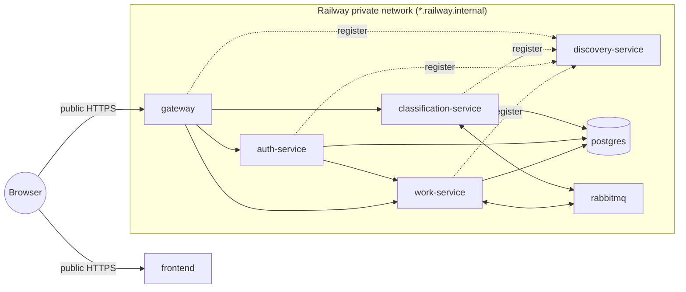

# Deploying to Railway

Eight Railway services in **one Railway project**, all from this GitHub repository except
RabbitMQ, which is a plain Docker image.



Only **frontend** and **gateway** get a public domain. Everything else is reachable only on the
private network, which is the same boundary the local setup draws with `localhost`.

---

## 1. Create the services

In Railway: **New Project → Deploy from GitHub repo**, pick this repository, then add the rest with
**+ New → GitHub Repo** (same repo each time). For every service set **Settings → Source → Root
Directory**; Railway then finds the `Dockerfile` in that folder by itself.

**Name each service exactly as in the first column.** The name becomes its private hostname
(`work-service.railway.internal`), and the variables below refer to services by these names.

| Service name | Source | Root Directory | Public domain | Volume |
|---|---|---|---|---|
| `postgres` | GitHub repo | `docker/postgres` | no | **yes**, mounted at `/var/lib/postgresql/data` |
| `rabbitmq` | Docker image `rabbitmq:3-management` | — | no | no |
| `discovery-service` | GitHub repo | `services/discovery-service` | no | no |
| `work-service` | GitHub repo | `services/work-service` | no | no |
| `auth-service` | GitHub repo | `services/auth-service` | no | no |
| `classification-service` | GitHub repo | `services/classification-service` | no | no |
| `gateway` | GitHub repo | `services/gateway` | **yes**, target port 8080 | no |
| `frontend` | GitHub repo | `frontend` | **yes**, target port 8080 | no |

Without the volume on `postgres`, every redeploy starts from an empty database.

**Watch Paths** (Settings → Build): set one per service, e.g. `/services/work-service/**` for
work-service and `/frontend/**` for the frontend. Otherwise a commit that changes only the frontend
rebuilds all seven images.

---

## 2. Shared variables

**Project Settings → Shared Variables**. Generate long random values; never reuse the local
defaults.

| Name | Value |
|---|---|
| `JWT_SECRET` | at least 32 characters. The same secret must reach auth-service, work-service, classification-service and gateway, which is why it is shared |
| `DB_PASSWORD` | Postgres password |
| `RABBITMQ_PASSWORD` | RabbitMQ password |

---

## 3. Variables per service

Paste these into each service's **Variables → Raw Editor**. `${{...}}` is Railway's reference
syntax: `${{shared.X}}` is a shared variable, `${{postgres.RAILWAY_PRIVATE_DOMAIN}}` is another
service's private hostname, and `${{RAILWAY_PRIVATE_DOMAIN}}` is the service's own.

**postgres**

```
POSTGRES_USER=workflow
POSTGRES_DB=workflow
POSTGRES_PASSWORD=${{shared.DB_PASSWORD}}
```

`POSTGRES_USER` must stay `workflow`: the init script creates `authdb` and `vectordb` owned by that
role.

**rabbitmq**

```
RABBITMQ_DEFAULT_USER=workflow
RABBITMQ_DEFAULT_PASS=${{shared.RABBITMQ_PASSWORD}}
```

**discovery-service**

```
PORT=8080
```

**work-service**

```
PORT=8080
DB_URL=jdbc:postgresql://${{postgres.RAILWAY_PRIVATE_DOMAIN}}:5432/workflow
DB_USERNAME=workflow
DB_PASSWORD=${{shared.DB_PASSWORD}}
RABBITMQ_HOST=${{rabbitmq.RAILWAY_PRIVATE_DOMAIN}}
RABBITMQ_USERNAME=workflow
RABBITMQ_PASSWORD=${{shared.RABBITMQ_PASSWORD}}
EUREKA_URL=http://${{discovery-service.RAILWAY_PRIVATE_DOMAIN}}:8080/eureka
EUREKA_PREFER_IP_ADDRESS=false
EUREKA_INSTANCE_HOSTNAME=${{RAILWAY_PRIVATE_DOMAIN}}
JWT_SECRET=${{shared.JWT_SECRET}}
```

**auth-service**

```
PORT=8080
DB_URL=jdbc:postgresql://${{postgres.RAILWAY_PRIVATE_DOMAIN}}:5432/authdb
DB_USERNAME=workflow
DB_PASSWORD=${{shared.DB_PASSWORD}}
EUREKA_URL=http://${{discovery-service.RAILWAY_PRIVATE_DOMAIN}}:8080/eureka
EUREKA_PREFER_IP_ADDRESS=false
EUREKA_INSTANCE_HOSTNAME=${{RAILWAY_PRIVATE_DOMAIN}}
JWT_SECRET=${{shared.JWT_SECRET}}
```

**classification-service**

```
PORT=8080
DB_URL=jdbc:postgresql://${{postgres.RAILWAY_PRIVATE_DOMAIN}}:5432/vectordb
DB_USERNAME=workflow
DB_PASSWORD=${{shared.DB_PASSWORD}}
RABBITMQ_HOST=${{rabbitmq.RAILWAY_PRIVATE_DOMAIN}}
RABBITMQ_USERNAME=workflow
RABBITMQ_PASSWORD=${{shared.RABBITMQ_PASSWORD}}
EUREKA_URL=http://${{discovery-service.RAILWAY_PRIVATE_DOMAIN}}:8080/eureka
EUREKA_PREFER_IP_ADDRESS=false
EUREKA_INSTANCE_HOSTNAME=${{RAILWAY_PRIVATE_DOMAIN}}
JWT_SECRET=${{shared.JWT_SECRET}}
# Optional - without these two it runs the keyword stub, not real AI:
CLASSIFICATION_PROVIDER=groq
GROQ_API_KEY=gsk_...
```

**gateway**

```
PORT=8080
EUREKA_URL=http://${{discovery-service.RAILWAY_PRIVATE_DOMAIN}}:8080/eureka
EUREKA_PREFER_IP_ADDRESS=false
EUREKA_INSTANCE_HOSTNAME=${{RAILWAY_PRIVATE_DOMAIN}}
JWT_SECRET=${{shared.JWT_SECRET}}
CORS_ALLOWED_ORIGINS=https://${{frontend.RAILWAY_PUBLIC_DOMAIN}}
```

**frontend**

```
PORT=8080
VITE_API_URL=https://${{gateway.RAILWAY_PUBLIC_DOMAIN}}
```

`VITE_API_URL` is read **at build time** and written into the JavaScript. Generate the gateway's
domain before the frontend's first build, and redeploy the frontend if that domain ever changes.

---

## 4. Health checks

For the five Java services: **Settings → Deploy → Healthcheck Path** = `/actuator/health`. It needs
no token. A deploy is then only switched over once the service is really up, database and broker
connections included.

---

## 5. First deploy

Railway starts everything at once, so the first minutes are noisy. That is expected:

- a service that starts before `postgres` or `rabbitmq` is ready fails, and Railway restarts it
  (the default restart policy is *on failure*);
- a service that starts before `discovery-service` retries its registration on its own;
- the gateway answers **404 or 503 for up to ~30 seconds** after a service registers, while the
  registry propagates — the same delay as locally;
- **classification-service downloads its ~80MB embedding model on every fresh container**, so its
  first start is slow. It keeps working without Groq either way.

Then open the frontend's public URL and sign in as **`admin` / `admin12345`**.

**Change that password straight away** — on Railway the app is on the internet, and the seeded one
is in this public repository. There is no password screen yet (BACKLOG item 44), so it is done in
the database. Open a shell on the `postgres` service (Railway CLI: `railway ssh --service postgres`)
and run:

```
psql -U workflow -d authdb
CREATE EXTENSION IF NOT EXISTS pgcrypto;
UPDATE account SET password_hash = crypt('your-new-long-password', gen_salt('bf', 10))
 WHERE username = 'admin';
```

`gen_salt('bf', 10)` is BCrypt at cost 10 — the same format auth-service writes, so it reads the new
hash like any other.

---

## 6. What was checked, and what was not

Checked on a local Docker network with this exact configuration shape:

- all seven images build from their Root Directory alone;
- every app on `PORT=8080`, registering in Eureka **by hostname** (`EUREKA_PREFER_IP_ADDRESS=false`),
  with only the gateway and frontend published;
- through the gateway: sign-in, create a project and an issue, the classification arriving over
  RabbitMQ, a status move and its history row, the duplicate search against pgvector, registration
  (auth-service calling work-service through Eureka), 401 without a token, and the CORS preflight
  from the frontend's origin;
- the nginx frontend in a browser: sign-in, and a hard refresh on `/projects/1/issues/1`;
- the password change in section 5 (old password refused, new one accepted);
- with the Eureka variables left unset, a service still registers by IP — the local behaviour is
  unchanged.

Not checkable from here: Railway itself — its private DNS, its `${{...}}` references and its build
cache. Those are the places to look first if a deploy misbehaves.

## When it goes wrong

| Symptom | Likely cause |
|---|---|
| Frontend loads, every call says "Cannot reach the server" | `VITE_API_URL` wrong or set after the frontend was built — redeploy the frontend. Or `CORS_ALLOWED_ORIGINS` on the gateway is not the frontend's exact `https://` URL |
| Gateway answers 503 `SERVICE_UNAVAILABLE` for minutes | the service did not register: check its `EUREKA_URL`, and that `EUREKA_PREFER_IP_ADDRESS=false` with `EUREKA_INSTANCE_HOSTNAME` set |
| work-service: `Connection to …:5432 refused` | `postgres` not up yet (it will retry through restarts), or the private domain reference has a typo |
| postgres: `initdb: directory … exists but is not empty` | the image's `PGDATA` was overridden; it must stay `/var/lib/postgresql/data/pgdata` |
| auth-service: `database "authdb" does not exist` | the volume held a cluster created without the init script. It only runs on an empty data directory — create `authdb` and `vectordb` by hand with `CREATE DATABASE ... OWNER workflow;` |
| Login returns 401 for a correct password | `JWT_SECRET` differs between services — use the shared variable everywhere |
| A service is killed and restarts over and over | out of memory. Each JVM takes a few hundred MB; raise the service's memory limit |
