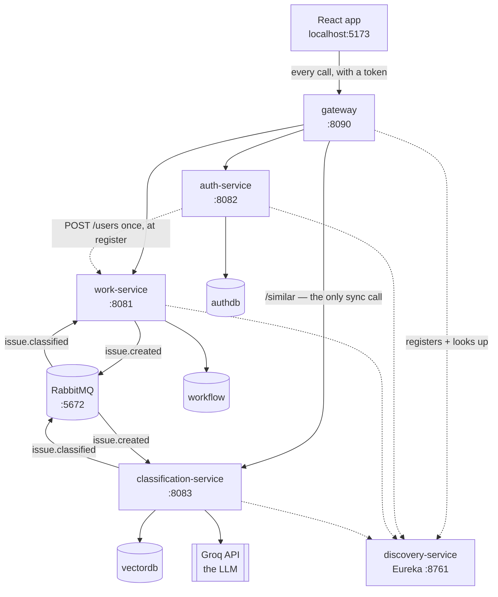

# The five services, explained simply

One page per service. Each page says what the service does, who talks to it, and how it works
inside. Plain words, with a diagram.

| Service | Port | In one sentence |
|---|---|---|
| [discovery-service](discovery-service.md) | 8761 | The phone book. Services tell it where they are; others ask it. |
| [gateway](gateway.md) | 8090 | The front door. The only address the browser knows. |
| [auth-service](auth-service.md) | 8082 | Accounts and passwords. Hands out the token. |
| [work-service](work-service.md) | 8081 | The real app: projects, boards, sprints, issues, comments. |
| [classification-service](classification-service.md) | 8083 | Reads a ticket and says what it is. Also finds duplicates. |

Support pieces, not services: **PostgreSQL** on 5433 (three databases), **RabbitMQ** on 5672
(management UI on 15672), and the **React app** on 5173.

---

## How they fit together



Read the arrows this way:

- **Solid arrow** = a normal HTTP call, someone is waiting for the answer.
- **Dotted arrow to Eureka** = registration and lookup, not a business call.
- **Arrow through RabbitMQ** = a message. Nobody waits. It arrives a second or two later.

---

## The two paths worth remembering

**Path 1 — a person does something.**
Browser → gateway → the right service → database → answer comes back. Fast, and the person waits.

**Path 2 — the AI answers.**
The person already got their answer and moved on. Meanwhile work-service dropped a message on
RabbitMQ, classification-service picked it up, asked Groq, and sent the answer back over another
message. The suggestion appears on the screen a moment later.

Path 2 exists so a slow or broken AI can never make creating a ticket slow or broken.

---

## Start order

```
docker compose up -d      (Postgres + RabbitMQ)
discovery  →  work  →  auth  →  classification  →  gateway
```

Eureka needs up to ~30 seconds to notice a service. `http://localhost:8761` must list all four
before the gateway can route anything.
