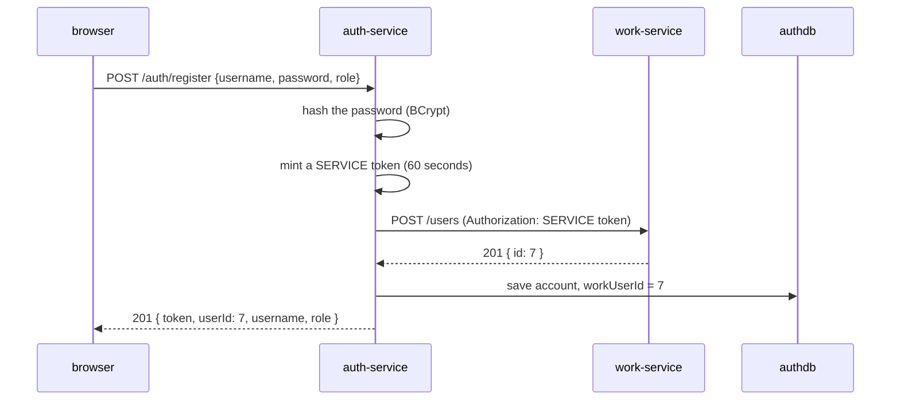

# auth-service — who you are

**Port 8082 · database `authdb` · Spring Security + JWT**

Three endpoints. It owns accounts and passwords, and it is the only place a token is created.

| Endpoint | Token needed | What it does |
|---|---|---|
| `POST /auth/register` | no | Creates an account **and** a work-service profile. Returns a token. |
| `POST /auth/login` | no | Checks the password. Returns a token. |
| `GET /auth/me` | yes | Turns a token back into a user, with no database query. |

---

## Why it has its own database

`authdb` is a different database from `workflow`, in the same Postgres process.

work-service has no connection string to it, so work-service **cannot** join a password hash to an
issue even by accident. Sharing one Postgres process is a deployment convenience for a demo, not a
coupling — moving `authdb` onto its own server is a change to one line.

---

## Registration — the interesting one

A person needs two things: a login (here) and a profile that issues can point at (in work-service).



**Two decisions live in that diagram.**

**1 · The method is deliberately not `@Transactional`.**

A transaction would hold a pooled database connection open across an HTTP call to another service.
If work-service is slow, connections pile up and this service runs out — for a reason that has
nothing to do with its own database. So work-service is called first; only when it answers is the
row saved. If the call fails, nothing was written and the person can simply try again.

**2 · Registration mints a *service* token for itself.**

The person has no token yet — that is why they are registering. But `POST /users` on work-service
must not be open to the world.

The answer is a second, tiny token with `role = SERVICE` and a **60-second** life:

```java
public static final String SERVICE_ROLE = "SERVICE";
private static final Duration SERVICE_TOKEN_TTL = Duration.ofSeconds(60);
```

work-service then requires `hasRole("SERVICE")` on that one endpoint. **Same JWT mechanism, no
second authentication scheme, and no hole punched for registration.** If a service token ever
leaked it would be useless within the minute.

---

## What is inside the token

```json
{
  "iss": "auth-service",
  "sub": "moni",
  "uid": 7,
  "role": "DEVELOPER",
  "iat": 1787699029,
  "exp": 1787702629
}
```

| Claim | Why it is there |
|---|---|
| `iss` | Every service checks it. A valid signature from another system sharing the secret is still not our token. |
| `sub` | The username. For **reading logs**, not for joining rows. |
| `uid` | **The claim that makes the system work.** The work-service user id. An issue's reporter is a work-service id, so carrying it here means no service ever calls back to ask "who is this?". |
| `role` | work-service turns it into `ROLE_DEVELOPER` so `hasRole("...")` works. |
| `exp` | One hour. Long enough not to interrupt someone mid-task, short enough that a leaked token dies on its own. |

Signed with **HS256** — one shared secret, and `JwtConfig` refuses to start if it is under 32
characters rather than signing weakly.

> **Why one shared secret and not a public/private key pair?** HS256 means every service can verify
> but every service could also *forge*. RS256 would fix that: auth-service holds the private key,
> everyone else holds only the public one. It is in `docs/BACKLOG.md` as the real production answer.

---

## `GET /auth/me` never touches the database

If the signature holds, the claims were written by this service and have not been altered. Reading
the row back would only confirm something already proven.

The React app calls it once at startup to turn a token kept in `localStorage` back into a signed-in
user.

One small trap, worth knowing:

```java
Number userId = jwt.getClaim(JwtIssuer.CLAIM_USER_ID);
return new CurrentUser(userId.longValue(), ...);
```

Read through `Number`, not straight to `Long`. JSON has **one** number type, so a claim comes back
as an `Integer` or a `Long` depending on its size. Casting straight to `Long` works in testing and
fails on a large id.

---

## The bug that broke Eureka

`RestClientConfig` looks strange until you know why:

```java
@Bean @Primary @Scope("prototype")
public RestClient.Builder restClientBuilder() { return RestClient.builder(); }

@Bean @LoadBalanced
public RestClient.Builder loadBalancedRestClientBuilder() { ... }
```

The first attempt had **one** builder marked `@LoadBalanced`. Registration then failed with
`No instances available for localhost`.

The cause: Spring Cloud builds **Eureka's own HTTP client** from that same bean. Marking it
load-balanced told Eureka to look up "localhost" in the registry — and localhost is not a registered
service. The registry client was trying to use the registry to find the registry.

Fix: two builders. A plain `@Primary` one for the framework, and a `@LoadBalanced` one injected by
name for calls to `lb://work-service`.

---

## Sentence for the defence

> auth-service owns accounts and is the only issuer of tokens. Registration is not transactional on
> purpose, because a transaction must never be held open across a call to another service. And it
> issues itself a 60-second SERVICE token to create the profile, so `POST /users` stays locked
> instead of being left open for registration.
