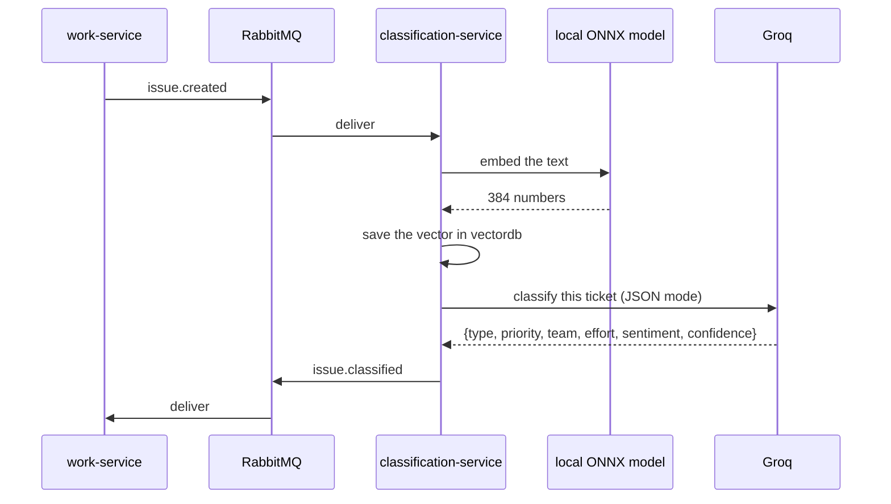
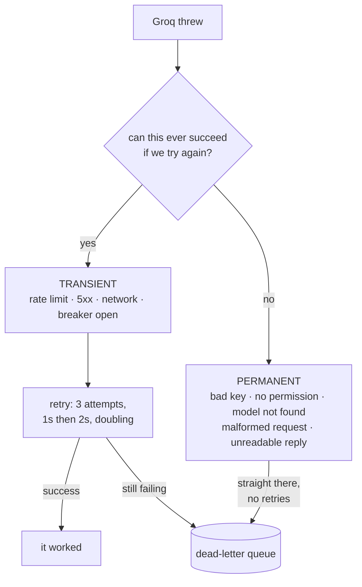
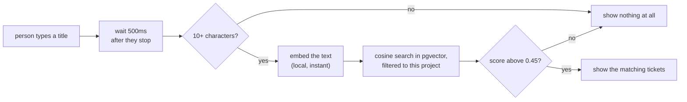

# classification-service — the AI layer

**Port 8083 · database `vectordb` · Spring AI 2.0 + RabbitMQ + pgvector**

It does two jobs that look related but behave in opposite ways.

| Job | How it runs | Who waits |
|---|---|---|
| **Classify a ticket** — type, priority, team, effort, sentiment | over RabbitMQ, asynchronous | nobody |
| **Find duplicates** — tickets that already say this | over HTTP, synchronous | somebody typing |

That difference explains almost every design choice in this service.

> **It stores no issue and no classification.** The `ai_classification` row belongs to work-service,
> next to the issue it describes. This service owns only the vectors, which are derived data.

---

## Job 1 — classifying, over the queue



**The order is deliberate.** Indexing happens **before** classifying. Indexing is local and cannot
fail for an external reason; the Groq call can. Doing it first means a Groq outage costs the
suggestion but **not** the duplicate detection. Two features arrive on the same message and should
not share one failure.

---

## Two models, two very different things

This is the part people mix up, so it is worth saying plainly.

| | **Groq** | **all-MiniLM-L6-v2** |
|---|---|---|
| What it does | reads a ticket and judges it | turns text into 384 numbers |
| Where it runs | Groq's servers, over the internet | **inside this Java process**, as ONNX |
| Needs an API key | yes | **no** |
| Costs money / has a rate limit | yes | no |
| Used for | classification | similarity search |

> **The architecture diagram was wrong.** It labelled Groq as *"LLM + embeddings"*. Groq has **no
> embeddings endpoint at all** — found at the end of M3. The replacement is better than the thing
> it replaced: no API key, no network call, no rate limit, and the same input always produces the
> same vector. A similarity search that works with the wifi off is worth more at a demo than a
> marginally better vector.

The first startup downloads about 80MB and **looks like a hang**. It is not. Every start after that
reads from the cache and is offline.

Because two model starters sit on one classpath, both roles must be named or the context fails on
an ambiguity that reads like a broken dependency:

```properties
spring.ai.model.chat=openai        # Groq, for reading
spring.ai.model.embedding=transformers   # local ONNX, for vectors
```

---

## Talking to Groq

Groq speaks OpenAI's protocol, so **the OpenAI client is the Groq client** — only the URL changes.

```properties
spring.ai.openai.base-url=https://api.groq.com/openai/v1
spring.ai.openai.chat.options.model=openai/gpt-oss-120b
spring.ai.openai.chat.options.response-format.type=JSON_OBJECT
spring.ai.openai.chat.options.temperature=0.2
spring.ai.openai.chat.options.reasoning-effort=low
```

Line by line, and each one was paid for:

**The `/v1` is required.** Spring AI 2.0 builds on the official `openai-java` SDK, which appends
only `/chat/completions`. Without it Groq answers *"Unknown request URL"* — and the mistake is
invisible until a key exists to try it with.

**`openai/gpt-oss-120b`, not `llama-3.3-70b-versatile`.** That second name is what every tutorial
uses and **it is not on Groq at all**. Check `GET /v1/models` before believing anything.

**120b over the smaller 20b, for one measured reason.** Given a ticket reading *"Production is
broken, urgent, everyone affected"*:

| Model | sentiment |
|---|---|
| gpt-oss-20b | **+0.8** — it read an outage as cheerful |
| gpt-oss-120b | **−0.9** |

Both got type and priority right. The difference was on the field that actually needs reading
comprehension.

**`JSON_OBJECT`, not `JSON_SCHEMA`.** Groq supports the first everywhere and the second only on some
models. Spring AI puts the schema into the prompt from the `Suggestion` record either way.

**`temperature=0.2`, not the default 0.8.** This is a classification. The same ticket should get the
same answer twice, and creativity is the opposite of what is wanted.

**`reasoning-effort=low` — not a micro-optimisation.** The gpt-oss models think at length before
answering, and that thinking is billed:

| | output tokens | verdict |
|---|---|---|
| default | 306 | BUG / CRITICAL / −0.90 |
| low | **80** | BUG / CRITICAL / −0.92 |

Identical judgement for a quarter of the tokens. Groq's free tier allows **8000 tokens per minute**;
at 306 tokens a ticket, a handful filed together exhausts it. The smoke test did exactly that and
drove real 429s.

### Structured output

The answer is not parsed from prose. `Suggestion` is a Java record, and Spring AI turns it into a
JSON schema, puts that in the prompt, and maps the reply straight back:

```java
Suggestion s = chatClient.prompt().user(ticketText).call().entity(Suggestion.class);
```

The record **is** the prompt's other half. Adding a field changes the prompt.

---

## No key? The stub

```properties
app.classification.provider=${CLASSIFICATION_PROVIDER:stub}
```

`stub` is the default so the project runs on a fresh clone with nothing configured. It is keyword
rules, **not intelligence**, and it says so three ways:

1. a warning on startup,
2. `modelVersion=stub-v1` stamped on every row it produces,
3. that version printed on the suggestion chip in the UI.

> Demonstrating the stub while believing it was AI would be the worst thing to discover in front of
> a jury.

For the real thing:

```powershell
$env:GROQ_API_KEY = "gsk_..."          # never in a file
$env:CLASSIFICATION_PROVIDER = "groq"
```

---

## When Groq fails — the part that matters most

Not every failure deserves a retry. `GroqClassifier.translate(...)` sorts them into two piles, and
that decision is the dead-letter queue's whole brain.



Retrying a rejected API key three times only proves a second and third time what is already known,
while the queue stops moving for every other ticket.

### The one property that makes any of this work

```properties
spring.rabbitmq.listener.simple.default-requeue-rejected=false
```

The default is `true`: a failed message goes **straight back on the queue** and is retried forever
at full speed. The queue never drains, the DLQ stays empty, and **nothing anywhere says the system
is stuck**. This single line is the difference between having a dead-letter queue and only thinking
you do.

### Replaying

`/admin/classification/dead-letters` counts them. `/admin/classification/replay` moves them back —
both ADMIN-only.

Replay moves the **raw `Message`**, not a converted object, so the headers (the correlation id
included) survive the round trip. An early version used `receiveAndConvert` and got a
`LinkedHashMap` back, which fails outside a listener.

### Concurrency is deliberately small

```properties
spring.rabbitmq.listener.simple.concurrency=2
spring.rabbitmq.listener.simple.prefetch=1
```

Each message costs an API call to a provider with a rate limit. More threads would buy 429s, not
speed.

---

## Job 2 — finding duplicates, over HTTP

```
GET /similar?text=...&projectKey=...&excludeIssueId=...
```

The one synchronous thing this service does, and the only route the gateway sends here directly.

> Everything else here is queue-driven because nobody is waiting. Here somebody is: the answer is
> worthless once they have pressed submit. It is the one call where a queue would be the wrong tool.



### The threshold was measured, not guessed

Against a ticket reading *"Login page crashes with a 500 error"*:

| Candidate | score |
|---|---|
| identical wording | 0.85 |
| "Login page fails with 500 for all users" | 0.75 |
| "Login screen throws a 500 when signing in" | 0.72 |
| "Sign-in screen returns a server error every time" | 0.54 |
| "Users report the login is broken" | 0.49 |
| "Add CSV export to the monthly reports page" | under 0.20 |
| "Repaint the bicycle shed a nicer shade of green" | under 0.20 |

Every one of the first five is the **same bug**. Unrelated tickets never reach 0.20, so the gap
between "a rephrasing" and "a different ticket" is wide — and the threshold belongs inside it.

The first guess was **0.75**, which would have caught only near-identical wording and missed most
real duplicates: exactly the failure a duplicate detector exists to prevent.

**The two thresholds in this project lean opposite ways, on purpose.** Auto-apply is high (0.85)
because it changes a ticket with nobody watching. This one is low (0.45) because it only offers a
suggestion — a false positive costs a glance, a false negative costs a duplicate ticket.

### Scoped to the project

A duplicate in somebody else's project is not a duplicate. The search carries a metadata filter on
`projectKey`.

---

## The vector store

```sql
CREATE EXTENSION IF NOT EXISTS vector;
CREATE TABLE issue_vector (
    id        uuid PRIMARY KEY DEFAULT gen_random_uuid(),
    content   text,
    metadata  jsonb,
    embedding vector(384)
);
CREATE INDEX ... USING hnsw (embedding vector_cosine_ops);
```

**384 is load-bearing.** It is `all-MiniLM-L6-v2`'s output size. A mismatch fails on the first
insert with an error that says nothing about the model.

**HNSW over IVFFlat**, because HNSW needs no training data — which matters when the table starts
empty.

**Cosine distance**, because sentence embeddings are compared by *direction*, not length. A long
ticket and a short one saying the same thing should still match.

**Liquibase creates the table, not Spring AI** (`initialize-schema=false`). Spring AI will happily
build its own table at startup, and then the schema has two owners. Every other table in this system
comes from a reviewed migration; one table that appears by itself is the one nobody can explain
later.

### Keeping it honest

| Event | What happens |
|---|---|
| an issue is created | its vector is stored |
| an issue is **deleted** | `issue.deleted` arrives, the vector is removed |
| a **project** is deleted | `project.deleted` arrives, all its vectors go |
| the table is lost | `POST /admin/issues/reindex` rebuilds it |

The deletes have to be told. `ai_classification` disappears with its issue through
`ON DELETE CASCADE`, but **a vector in a different database has no foreign key to cascade along**.
Left alone, the duplicate panel would keep offering tickets that no longer exist — silently, and
getting worse.

Reindex is not a backfill script. It **republishes `issue.created`** for every issue, so it reuses
the classification path end to end and there is no second code path to keep correct. It is
idempotent because `index()` deletes before inserting, and because work-service updates its
classification by `issue_id`.

`vectordb` is the only database in this project that can be thrown away.

---

## Sentence for the defence

> This service does two jobs with opposite shapes. Classification goes over a queue because nobody
> is waiting, and a broken Groq must never stop a ticket from being created. Duplicate detection is
> a direct HTTP call because somebody is typing right now. The failure handling is the part I would
> point at: permanent failures go straight to the dead-letter queue instead of being retried three
> times to prove what is already known.
