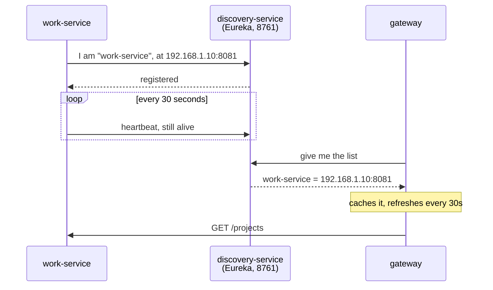

# discovery-service — the phone book

**Port 8761 · Eureka Server · no database · no business code**

The whole service is one class with one annotation. It is the smallest service in the project and
it is the first one that must start.

---

## The problem it solves

The gateway must send `/projects` to work-service. To do that it needs work-service's address.

The naive answer is to write `http://localhost:8081` in a config file. That breaks the moment
anything moves: a new port, a second copy of the service, a different machine. Every file holding
that address has to be found and edited.

Instead, each service **tells** the registry where it is when it starts. Anyone who needs an
address **asks** the registry. Nobody writes an address down.



---

## How a service registers

Nothing is written by hand. A service only needs this in its properties file:

```properties
eureka.client.service-url.defaultZone=http://localhost:8761/eureka
eureka.instance.prefer-ip-address=true
```

`prefer-ip-address=true` matters on Windows. Without it a service registers under the machine
name, and the machine name often does not resolve from another process — the gateway would then
hold an address it cannot dial.

---

## Why the registry does not register with itself

```properties
eureka.client.register-with-eureka=false
eureka.client.fetch-registry=false
```

Those two are what a **client** does. This instance **is** the registry, so both are switched off.
Leaving them on makes it try to register with itself and download its own list, which works but is
noise in the logs and confusing to read later.

---

## The word `lb://`

In the gateway's routes the address is written `lb://work-service`, not a host and a port.

- `lb` = load balancer.
- Spring Cloud sees the prefix, asks Eureka for every instance registered under that name, and
  picks one.
- If there were three copies of work-service running, requests would spread across them with no
  config change at all.

That single prefix is the payoff for running a registry.

---

## Heartbeats, and why a dead service disappears slowly

A registered service sends a heartbeat every 30 seconds. If Eureka misses several in a row it
removes the instance. This is not instant — a service that crashes can stay in the list for up to
about 90 seconds, and the gateway may try to call it during that window.

That gap is exactly why the gateway also has a **circuit breaker**. The registry says who *should*
be there; the breaker deals with who actually answers.

---

## What is deliberately not done

**One instance, no cluster.** In production Eureka runs as two or more peers replicating to each
other, so the registry itself is not a single point of failure. One is enough for a laptop demo,
and it is an extension, not an oversight.

---

## Sentence for the defence

> Eureka is a phone book. Services write their own entry when they start, and the gateway reads it
> instead of holding hardcoded addresses. That is what `lb://work-service` means — a name, resolved
> at call time, so a service can move or be duplicated without editing anything.
