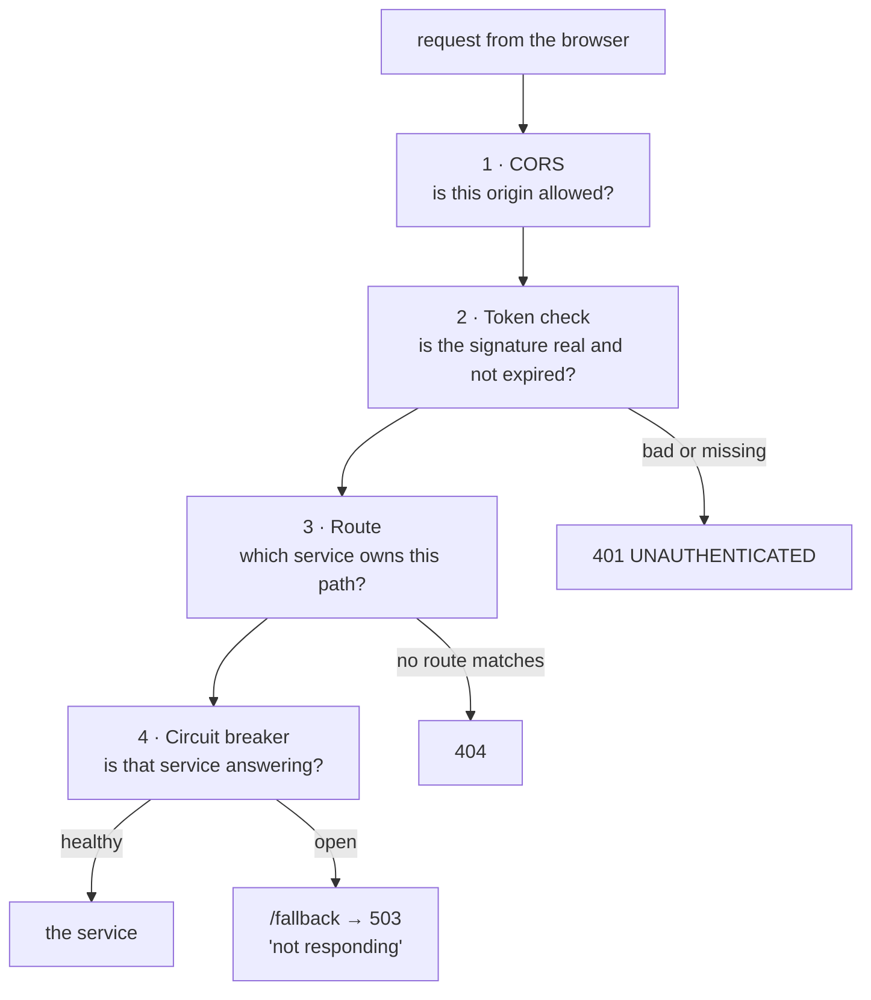
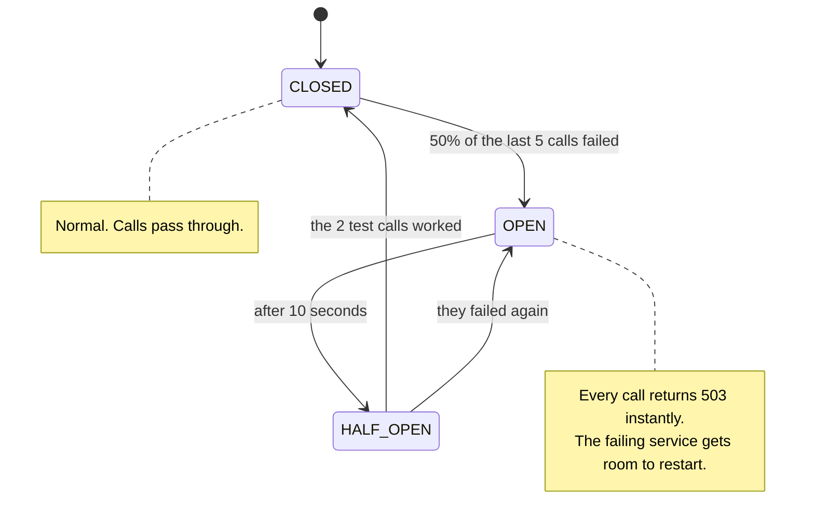

# gateway — the front door

**Port 8090 · Spring Cloud Gateway Server WebMVC · no database**

The browser knows one address: `http://localhost:8090`. It does not know that five services exist.

---

## What it does, in order

Every request goes through the same four steps.



---

## 1 · CORS — why the browser needs permission

The React app runs on port **5173**. The gateway is on **8090**. Different port means a different
origin, and a browser blocks that by default.

`CorsConfig` names the allowed origins:

```java
configuration.setAllowedOrigins(allowedOrigins);   // http://localhost:5173
configuration.setAllowCredentials(true);
```

**Never `"*"`.** The spec forbids combining `*` with `allowCredentials`, and the browser refuses
the pair.

> **The bug that cost an evening.** work-service also had a CORS config. The gateway added its own
> header and then forwarded work-service's, so `Access-Control-Allow-Origin` arrived **twice**. A
> browser rejects a duplicate. Every call failed with "cannot reach the server" while `curl` saw a
> clean 200 — because `curl` does not enforce CORS.
>
> Fixed at the source: work-service does no CORS at all now. The `DedupeResponseHeader` filter in
> the routes stays anyway, so no service downstream can break the browser contract again.

---

## 2 · The token check

The gateway **verifies** tokens. It never creates one — that is auth-service's job.

It holds the same secret and checks three things: the signature, the expiry, and the issuer.

```java
decoder.setJwtValidator(JwtValidators.createDefaultWithIssuer(issuer));
```

The issuer check matters: a valid signature from some *other* system that happens to share a
secret is still not a token this system should honour.

Only three paths are open without a token:

| Open path | Why |
|---|---|
| `/auth/register`, `/auth/login` | Not having a token is the reason you are there. |
| `/actuator/health` | A health check cannot need credentials. |
| `/error` | Spring forwards failures here internally. Without it, a 404 came back as a 401. |

**There are no role rules here.** The gateway answers one question: *is this a real caller?*
Whether that caller may delete a user is a question only work-service can answer, because only
work-service knows what its endpoints mean.

---

## 3 · Routing

Three routes. Each one names a **service**, never a host and port.

| Paths | Goes to |
|---|---|
| `/auth/**` | `lb://auth-service` |
| `/projects/**`, `/boards/**`, `/sprints/**`, `/issues/**`, `/users/**`, `/dashboard/**`, `/admin/issues/**` | `lb://work-service` |
| `/similar/**`, `/admin/classification/**` | `lb://classification-service` |

`lb://` means "ask Eureka". See [discovery-service](discovery-service.md).

**No path rewriting.** work-service already serves `/projects` at its root, so the URL the browser
sends is the URL the service receives. A stack trace can be read against the same path the user saw.

> **The cost of an allow-list.** `/sprints/**` was missing at first. The gateway answered 404 for a
> service that was perfectly healthy. An allow-list is safe by default and silent when incomplete —
> every new top-level path has to be added here.

Note the split on `/admin`: `/admin/issues/**` goes to work-service, `/admin/classification/**`
goes to the classifier. Same prefix, two services, because an operator's controls belong wherever
the thing they operate lives.

---

## 4 · The circuit breaker

If work-service is down, a request waits for a socket timeout and holds a gateway thread the whole
time. Enough of those and the gateway stops answering for the services that are still **healthy** —
one failure becomes every failure.

Resilience4j prevents that.



Settings and why:

| Setting | Value | Reason |
|---|---|---|
| `failure-rate-threshold` | 50% | Half the window failing is enough. |
| `sliding-window-size` | 5 | Small on purpose — the breaker can be *shown* opening during a defence. Production uses hundreds. |
| `wait-duration-in-open-state` | 10s | It retries by itself. Nobody has to restart the gateway. |
| `timeout-duration` | 5s | A hung service fails here instead of holding a thread. This timeout is the failure the breaker counts. |

When the breaker is open, `FallbackController` answers:

```json
{ "status": 503, "code": "SERVICE_UNAVAILABLE",
  "message": "work-service is not responding. The request was not carried out." }
```

**503, not 500.** The request was fine, the destination was not, and retrying later is reasonable.
The controller answers **every HTTP verb** — the breaker forwards the original request as it was,
and a POST landing on a GET-only handler would come back as a 405 that explains nothing.

---

## The correlation id

`CorrelationIdFilter` puts an `X-Correlation-Id` on every request that does not already have one.
It travels to every service, into their log lines, and even onto RabbitMQ message headers.

One user click, one id, one `grep` across five services.

---

## Two locks, not one

The gateway checks the token. **work-service checks it again.**

That is not duplicated work. work-service listens on its own port, and nothing forces a caller to
come through the gateway. The gateway is simply where a bad request fails cheaply.

---

## Sentence for the defence

> The gateway is the only address the browser knows. It does four things: CORS, verify the token,
> route by path to a service name that Eureka resolves, and trip a circuit breaker when a service
> stops answering so one dead service cannot take the whole gateway down with it.
