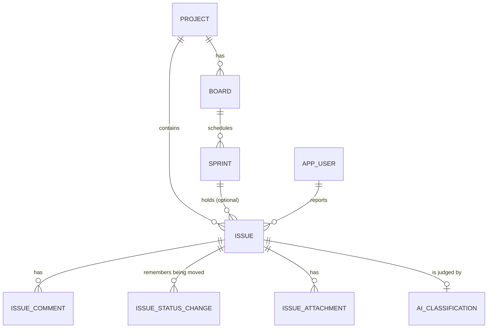
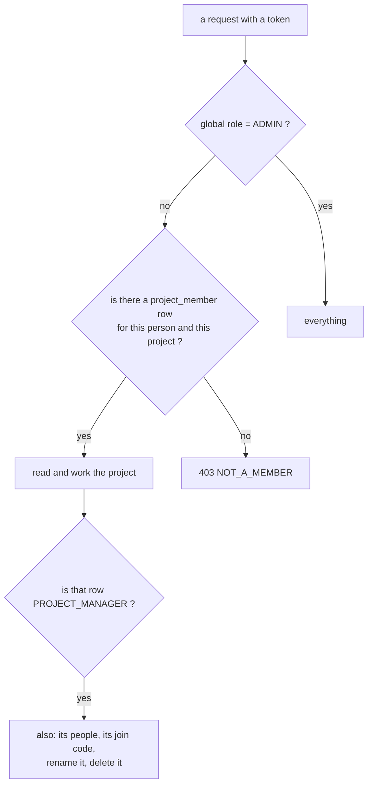
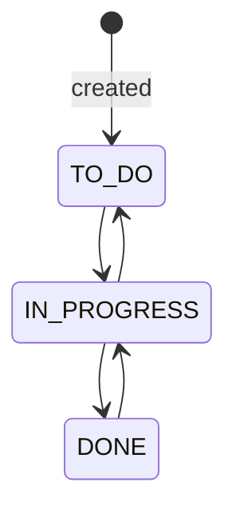
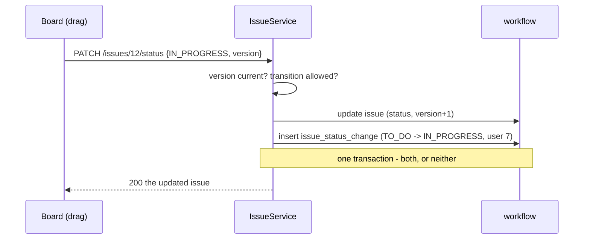
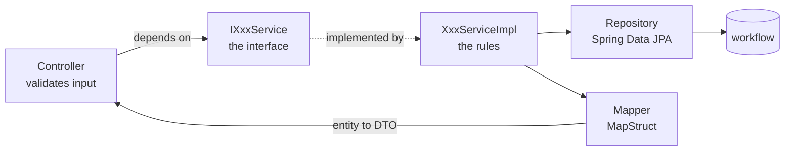
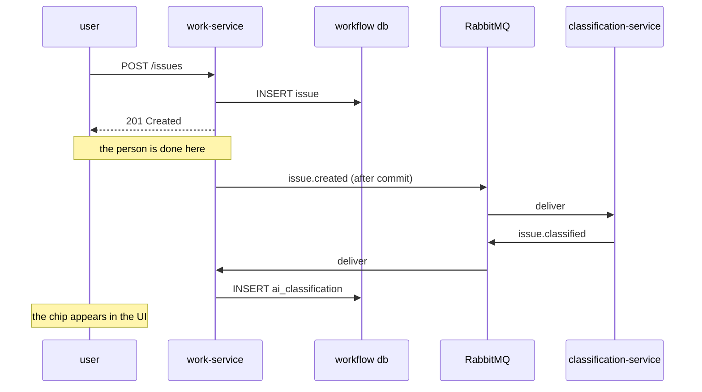
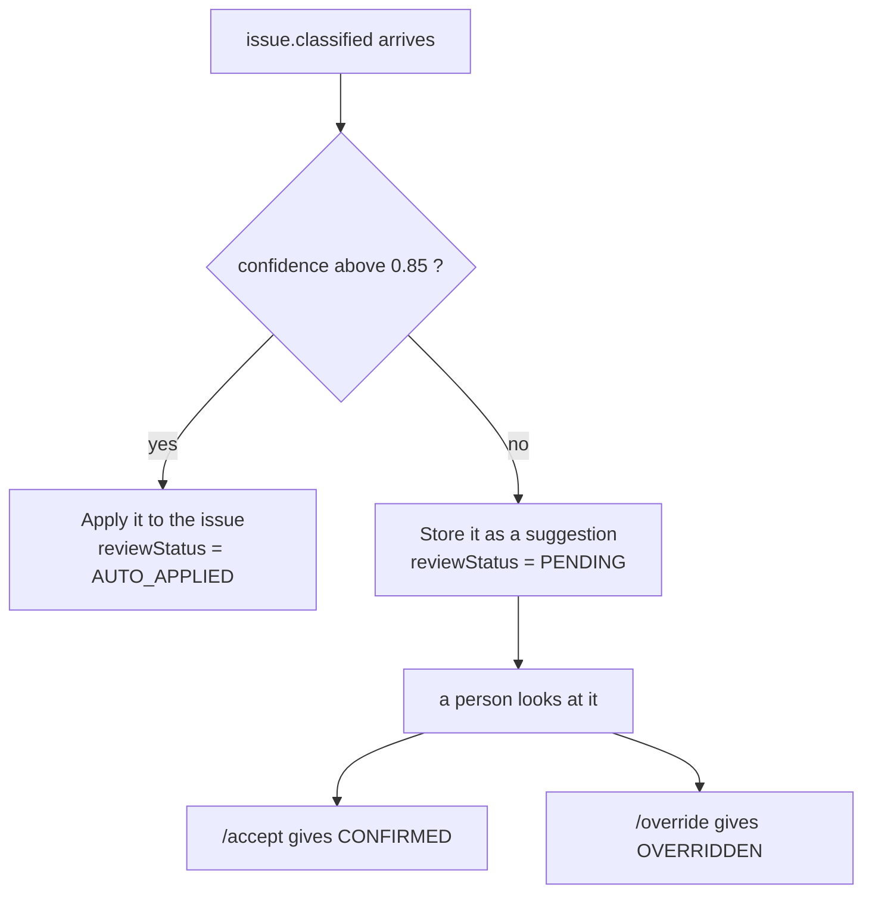

# work-service — the actual application

**Port 8081 · database `workflow` · JPA + Liquibase + MapStruct**

Everything a user thinks of as "the app" lives here: projects, boards, sprints, issues, comments,
attachments, users, and the dashboard. It was the whole project at M1; the other four services grew
around it.

---

## The domain, in one picture



An issue can sit in the **backlog** with no sprint. That is why the link from sprint is optional.

---

## The endpoints

| Path | What it is |
|---|---|
| `/projects` | create · list · read · update · delete |
| `/boards` | plus `/{id}/view` (the columns) and `/{id}/backlog` |
| `/sprints` | plus `/{id}/start` and `/{id}/complete` |
| `/issues` | plus `/{id}/status`, `/{id}/assignee` |
| `/issues/{id}/comments`, `/issues/{id}/attachments` | nested under their issue |
| `/issues/{id}/history` | every move of the card, oldest first. **GET only** — the rows are written by the move itself |
| `/issues/{id}/classification` | read the AI suggestion, `/accept` it, `/override` it |
| `/projects/{id}/members` | who is on it · add · change their project role · remove |
| `/projects/{id}/join-code` | the secret to mail somebody, plus `/rotate`. **Project manager only.** |
| `/projects/lookup` | turns a join code into a project name, so the asker can check before asking |
| `/projects/{id}/join-requests` | ask to join · the manager's queue · `/approve` · `/reject` |
| `/users` | `GET` is **ADMIN-only** (it returns everyone's email), `POST` and the two mirror endpoints are **SERVICE-only**, `DELETE` is **ADMIN-only** |
| `/dashboard` | one call, every number on the screen — for the projects you are on |
| `/admin/issues/reindex` | **ADMIN-only.** Replays every issue to rebuild the vectors. |

---

## Who sees what — M5

Two levels of role, because one cannot answer both questions:

| Question | Answered by | Lives in |
|---|---|---|
| What are you on the **platform**? | `Role` — DEVELOPER / MANAGER / ADMIN | the JWT `role` claim |
| What are you inside **this project**? | `ProjectRole` — PROJECT_MANAGER / MEMBER | `project_member`, read per request |



**`ProjectAccess` is the one place every one of those questions is asked.** Not `@PreAuthorize`:
`GET /issues/{id}` has to load the issue before anyone knows which project it belongs to, and
therefore whether the caller was allowed to see it. The check happens in the service, after the row
is in hand — the same place, and for the same reason, as the transition map below.

**Whoever creates a project is its first project manager.** Nobody appoints them, because there is
nobody on the project yet to do the appointing — and a project that started with no manager could
never gain one without an administrator stepping in every time.

**An administrator passes everything by a short-circuit, not by a membership row in every project.**
Rows would be a lie that needs maintaining, and would be wrong the moment somebody created a
project.

### The half that is easy to get wrong

Filtering `GET /projects` is decoration on its own: the project vanishes from a list while
`/issues/1`, `/issues/2` still answer one by one. Every entry point that resolves to a project
checks membership — boards, sprints, issues, comments, attachments, classifications, and the
dashboard. `smoke-test.sh` proves it by asking for a project **by id** with a valid token belonging
to somebody else, which is the only way the claim means anything.

---

## The rule the database cannot enforce

A status change is not free movement. `IssueService` holds a small map:

```java
Map<Status, Set<Status>> ALLOWED_TRANSITIONS = Map.of(
        Status.TO_DO,       EnumSet.of(Status.IN_PROGRESS),
        Status.IN_PROGRESS, EnumSet.of(Status.TO_DO, Status.DONE),
        Status.DONE,        EnumSet.of(Status.IN_PROGRESS));
```



Note what is **missing**: `TO_DO → DONE`. Work cannot be finished without having been started.
A `CHECK` constraint cannot express this, because the rule depends on the *previous* value. It
lives in Java, and `IssueStatusTransitionTest` is what proves it.

---

## Every move is written down

The board answers "where is this card"; it cannot answer "how did it get here". An update
overwrites `issue.status`, and the previous value is gone — so each accepted move also writes a
row into `issue_status_change`: from, to, who, when.



**Three decisions worth stating out loud:**

- **Same transaction as the move, not a listener.** A history written afterwards can fail on its
  own, and then the board shows a state nothing accounts for. Here a move that is not recorded is
  a move that did not happen.
- **Only real moves are recorded.** A refused transition throws before the write; a drop back on
  the same column returns early. Neither leaves a row, so a fumbled drag does not fill the history
  with moves nobody made.
- **The mover comes from the token**, exactly like the reporter of an issue and the author of a
  comment. It is never read from the request body, so nobody can file a move under another name.

Read it at `GET /issues/{id}/history`, oldest first. That is the only verb: a `POST` would let a
caller invent a move, a `DELETE` would let them erase one, so neither exists — and asking for one
now answers **405** with an `Allow` header rather than a 500. The row carries
`changedByUsername` as well as the id, because whoever moved the card may since have left the
project and "user 7" is not an answer.

---

## Layers, and why the controller never sees an entity



Four rules that never bend:

1. **The controller depends on the interface `IXxxService`, never the impl.** Swapping the
   implementation touches nothing else.
2. **A JPA entity is never returned from an endpoint.** MapStruct converts it to a DTO. An entity
   is tied to a database session; serialising one can trigger surprise lazy loads and leaks column
   names into the public API.
3. **Constructor injection, `private final`.** No `@Autowired` on fields — the object cannot exist
   in a half-built state, and it can be constructed in a test with plain `new`.
4. **Entities hold data only.** No methods, no logic.

Every `@ManyToOne` is `FetchType.LAZY`. The JPA default is EAGER, which quietly fetches the whole
graph on every read.

---

## Schema: Liquibase, and `validate`

```properties
spring.jpa.hibernate.ddl-auto=validate
```

`validate` means Hibernate **checks** that the tables match the entities and refuses to start if
they do not. It never changes anything.

Every table comes from a Liquibase changeSet instead. Two hard rules:

- **Never edit a changeSet that already ran.** Liquibase stores a checksum; editing it makes the
  next start fail. Add a new file.
- **The master file uses explicit `include:`, never `includeAll`.** `includeAll` sorts
  alphabetically, so `10-...` runs before `9-...` and the order silently goes wrong.

`ddl-auto=update` would be easier, and it is the reason people lose columns in production. It is
banned in `CLAUDE.md`.

Two naming traps already paid for: the table is **`app_user`** because `user` is reserved in
Postgres, and the column is **`project_key`** because `key` is reserved in H2.

---

## Messages: what work-service sends and receives

This service is on **both** ends of RabbitMQ.



### Publishing only after commit

```java
@TransactionalEventListener(phase = AFTER_COMMIT)
```

This is the detail that prevents a real race. Publish inside the transaction and the classifier can
read the queue faster than Postgres commits — it would then look up an issue that does not exist
yet, or worse, one whose transaction later rolled back. `AFTER_COMMIT` means: **the row is real
before anyone is told about it.**

Four events go out: `issue.created`, `issue.classified` (consumed here), `issue.deleted`,
`project.deleted`.

`project.deleted` is separate from `issue.deleted` on purpose. Deleting a project removes its issues
through `ON DELETE CASCADE` without `IssueService.deleteById` ever running — so nothing would
announce them one by one. One message for the whole cascade, matching how the deletion actually
happened.

### The bean that must be declared by hand

```java
@Bean
public RabbitAdmin rabbitAdmin(ConnectionFactory connectionFactory) {
    return new RabbitAdmin(connectionFactory);
}
```

Declaring your own `RabbitTemplate` makes Spring Boot's **entire** AMQP auto-configuration back off,
`RabbitAdmin` included. Without `RabbitAdmin`, the queue and exchange beans are created inside
Spring but never reach the broker. Nothing throws. The messages simply go nowhere.

---

## Accepting the AI's answer

When `issue.classified` arrives, `AIClassificationService` decides what to do with it:



`0.85` is high on purpose, and it is config, not a constant:

> A wrong auto-apply means somebody quietly works the wrong ticket. Not auto-applying costs one
> click. The two mistakes are not the same size, so the threshold sits well above half.

The listener is **idempotent** — `findByIssueId(...).orElseGet(AIClassification::new)`. The same
message delivered twice updates one row instead of creating two. RabbitMQ guarantees *at least
once* delivery, so a duplicate is normal, not exceptional.

Confidence is also clamped with `Math.clamp(value, 0f, 1f)`. A model that returns `1.4` must not be
trusted more than one that returns `1.0`.

---

## The dashboard, and the one honest number

`GET /dashboard` returns everything in **one** DTO. Five metric endpoints would be five chances for
a screen to render half-populated.

The number that judges the whole AI layer:

```
                 AUTO_APPLIED + CONFIRMED
agreement = ------------------------------------
             AUTO_APPLIED + CONFIRMED + OVERRIDDEN
```

**`PENDING` is excluded.** A suggestion nobody has looked at is not a disagreement. Counting it as
one would make the number fall every time somebody files a ticket — that measures activity, not
accuracy.

It returns **`null`, not `0`**, when nothing has been judged yet. Zero means "the AI is always
wrong". Null means "there is no answer yet", and the UI can say so.

This number is only computable because the outcome was recorded **at the moment it was decided**.
Inferring it later from the issue's current values would be impossible.

---

## Security here

The gateway already checked the token. This service checks it **again** — it listens on its own
port and nothing forces a caller to come through the gateway.

What is different here is that this service knows what its endpoints *mean*, so this is where roles
live:

| Rule | Why |
|---|---|
| `POST /users` needs `ROLE_SERVICE` | Only auth-service creates profiles, using its 60-second token. |
| `PUT /users/*/role`, `PUT /users/*/active` need `ROLE_SERVICE` | The global role and the account status belong to auth-service, which stamps one into tokens and answers logins with the other. These exist so it can mirror its decision here, and a browser cannot reach them. |
| `GET /users` needs `ROLE_ADMIN` or `ROLE_SERVICE` | It returns everybody's email. Any signed-in caller could read it before M5, because the board's assignee dropdown needed it; that dropdown reads `GET /projects/{id}/members` now. |
| `DELETE /users/**` needs `ROLE_ADMIN` | Destructive. |
| `/admin/**` needs `ROLE_ADMIN` | Operator controls. |
| everything else | `authenticated()` — deny by default, **and then** a membership check in the service. |
| `/error` | `permitAll()`, or a 404 comes back as a 401 and hides what really happened. |

**A path rule is not the whole answer here.** `authenticated()` gets a caller past the filter chain;
`ProjectAccess` decides whether the row they asked for is any of their business. The two are
different questions and only the first one can be answered from a URL.

**The bug M5 fixed.** `PUT /users/{id}` used to write `app_user.role` while tokens went on being
minted from `account.role` in the other database. Promoting somebody changed the profile and
nothing else: every token they were ever issued kept the old role, and nothing anywhere said so.
The role now changes in auth-service only and arrives here through `PUT /users/{id}/role`.

**No CORS at all.** See [gateway](gateway.md) for the duplicate-header bug that removed it.

---

## Sentence for the defence

> work-service is the application. Three things are worth pointing at: the transition map, which is
> a rule the database cannot express because it depends on the previous value; `AFTER_COMMIT`
> publishing, which guarantees a message is never sent about a row that does not exist yet; and
> `ProjectAccess`, which is checked in the service rather than on the path, because whether you may
> read an issue depends on the project it turns out to belong to.
